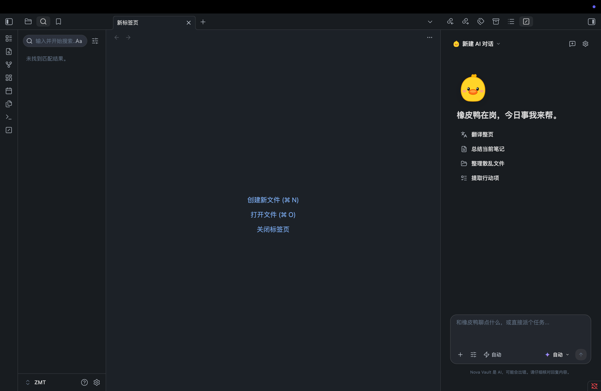

<p align="center">
  
  <h1 align="center">Rubber Duck 橡皮鸭</h1>
  <p align="center">
    <strong>极简美学设计 · 深度知识库 RAG 与自主 Multi-Agent 智能体</strong>
  </p>
  <p align="center">
    Next-Generation Agentic AI Copilot for Obsidian with Minimalist Aesthetics & Deep Knowledge Graph RAG
  </p>
  <p align="center">
    <a href="#-quick-start"></a>
    <a href="#-license"></a>
    
    
  </p>
</p>

<p align="center">
  
</p>

---

[**中文文档**](#-中文说明) | [**English Documentation**](#-english-documentation)

---

## 🇨🇳 中文说明

**橡皮鸭 (Rubber Duck)** 是一款专为 Obsidian 打造的下一代自主 AI 智能体与知识库中枢。它不仅拥有极具呼吸感、克制优雅的 **极简交互界面**，更将深度语义检索（Vector RAG）、自主多步推理循环（Agent Loop）、长期记忆事实库与标准化 MCP（Model Context Protocol）协议深度融合，让你在本地笔记中拥有超越商业级 AI 助手的全能知识管理体验。

---

### 🌟 核心特性概览

#### 🎨 1. 极简交互美学
- **1:1 原生级设计语言**：黑白中性色调、柔和圆角卡片、无边框悬停动作项与清晰大标题。
- **智能下拉浮窗（Dropdown Popover）**：点击顶部 `新建 AI 对话 ⌵` 即可直接呼出轻量历史会话卡片，随点即查，点击外部自动收起。
- **一体化输入卡片**：`16px` 大圆角高质感悬浮卡片，集成当前活动笔记药丸标签（Context Pill）与向上箭头（`↑`）发送键。

#### 🧠 2. 深度语义检索与本地 RAG（Semantic Search）
- **向量语义理解**：结合向量索引、全文关键字检索与双向链接图谱扩展（Graph Expansion），AI 能根据概念含义而非僵硬的字面匹配找到相关笔记。
- **隐式关联洞察**：自动发掘库内尚未建立双链的潜在关联笔记对，激发全新洞见。
- **逐段溯源（Provenance）**：读取 PDF 与文献时，自动提取关键论点并绑定精准到段落的 Block ID 双向引用。

#### 🤖 3. 自主多智能体循环（Autonomous Agent Loop）
- **目标分解与自主执行**：不仅仅是问答，AI 能够自主拆解任务、读取多篇笔记、检索互联网、生成大纲、编辑内容并向你汇报成果。
- **严格权限防线（Fail-Closed Permissions）**：文件写入与敏感操作均需用户显式批准，每一次更改均支持一键回滚撤销（Undo）。
- **多会话并发**：支持多标签页独立并行运行不同任务，互不阻塞。

#### ⚡ 4. 划词行内助手（Inline AI Copilot）
- 在编辑器任意位置选中文本，按快捷键 `Cmd/Ctrl + Shift + I`（或右键菜单）即可唤起浮动交互栏。
- 一键进行**智能润色、扩写扩充、精简提炼、中英互译、代码解释与提取 Action Items 待办项**。

#### 📊 5. 知识库健康体检与文档自动化
- **全库健康体检（Vault Health Audit）**：一键扫描并修复孤岛笔记（Orphan Notes）、失效死链（Broken Links）、缺失反链与过度集中的枢纽笔记。
- **富文档自动导出**：一键将笔记内容提炼生成 Word (DOCX)、Excel (XLSX) 或演示文稿 (PPTX)。
- **Canvas 白板自动化**：根据对话主题自动生成结构严密、带连线与标签的 Obsidian Canvas 白板思维导图。

#### 🛠️ 6. 开放技能与 MCP 协议扩展（Model Context Protocol）
- **Prompt 技能包（Skills）**：支持加载开放规范的 Prompt Cheatsheet，扩展专业领域能力。
- **Obsidian 充当 MCP Server**：将本地 Obsidian 知识库作为 MCP 服务端开放给 **ChatGPT、Claude Desktop、Cursor**，实现跨软件调用与数据同步。
- **连接外部 MCP**：接入 PostgreSQL、GitHub 等外部服务，直接在 Obsidian 中查询数据库与操作代码。

#### 🔒 7. 本地优先与企业级安全（Local-First & Secure）
- **零遥测**：无账号系统、无后台埋点与数据上传。
- **系统级 Keychain 加密**：API Key 通过操作系统底层安全存储（macOS Keychain / Windows 凭据管理器）进行硬件级加密。
- **完全离线支持**：无缝对接 Ollama、LM Studio 等本地开源大模型，断网环境亦可完全离线运行。

---

### 🔌 支持的模型服务商

| 提供商 | 推荐模型 | 特性优势 |
| :--- | :--- | :--- |
| **Anthropic** | Claude 3.7 Sonnet / 3.5 Sonnet | 卓越的复杂逻辑推理、结构规划与代码重构能力 |
| **OpenAI** | GPT-4o / o1 / o3-mini | 极速响应、强大的多模态理解与深度思考链支持 |
| **DeepSeek** | DeepSeek-V3 / DeepSeek-R1 | 极高性价比、顶尖中文语义理解与数学逻辑能力 |
| **Google** | Gemini 2.0 Flash / Pro | 超长上下文窗口（百万 Token 级别）支持 |
| **本地私有化** | Ollama / LM Studio | 100% 离线与数据隐私，支持 Qwen 2.5、Llama 3 等 |
| **聚合网关** | OpenRouter / Groq / SiliconFlow | 灵活接入全球各大前沿开源与商业大模型 |

---

### 🚀 快捷键与使用技巧

| 快捷操作 | 说明 |
| :--- | :--- |
| **`Cmd/Ctrl + Shift + I`** | 选中文本唤起行内 AI 悬浮动作栏（Inline AI） |
| **`Enter` / `Cmd + Enter`** | 发送对话消息（可在设置中自由切换） |
| **`Esc`** | 立即中断当前正在运行的 AI 任务 |
| **`/`（斜杠）** | 在输入框快速联想预设 Prompt 模板与工作流 |
| **`@`（艾特）** | 快速关联引用 Vault 内的笔记、文件夹或图片 |
| **拖拽文件** | 直接将 PDF、图片或 Markdown 文件拖入输入框快速挂载 |

---

### 📦 安装指南

#### 方式一：手动安装（推荐）
1. 前往 [Releases](https://github.com/KD-Leon/Rubber/releases) 页面下载最新的 `main.js`、`manifest.json`、`styles.css`；
2. 打开你的 Obsidian 知识库目录，进入 `.obsidian/plugins/`；
3. 创建名为 `rubber-duck` 的文件夹，并将下载的 3 个文件放入其中；
4. 打开 Obsidian，进入 **设置 -> 第三方插件**，启用 **Rubber Duck (橡皮鸭)** 即可开始使用。

#### 方式二：本地开发与构建
```bash
# 1. 克隆仓库
git clone https://github.com/KD-Leon/Rubber.git
cd nova-vault

# 2. 安装依赖
npm install

# 3. 生产打包
npm run build

# 4. 监听热编译（可在 .env 中配置 PLUGIN_DIR 自动部署到本地 Vault）
npm run dev
```

---

## 🌐 English Documentation

**Rubber Duck** is a next-generation autonomous AI operating layer and intelligent knowledge hub designed exclusively for Obsidian. Combining the sleek, distraction-free minimalist design with deep local vector RAG, multi-step autonomous agent loops, long-term memory, and open MCP connectivity.

### 🌟 Key Highlights

- **Minimalist Aesthetic**: 1:1 minimalist typography, floating popover history menus, 16px rounded card composer, and distraction-free action lists.
- **Deep Semantic RAG**: Vector embeddings, keyword search, and wikilink graph expansion locate notes by conceptual meaning.
- **Autonomous Agent Loop**: Autonomous multi-step planning, file reading/writing, web fetching, and structured reporting with one-click undo checkpoints.
- **Inline AI Copilot (`Cmd/Ctrl + Shift + I`)**: Select any text in notes to polish, expand, summarize, translate, or extract action items immediately.
- **Full Safety Controls**: Fail-closed architecture with explicit approval gates for file writes, shell actions, and network calls.
- **Vault Health Auditing**: Identifies and repairs orphan notes, broken links, missing backlinks, and over-connected hubs.
- **Office & Canvas Automation**: Automatically generates Word (DOCX), Excel (XLSX), PowerPoint (PPTX), and Obsidian Canvas mindmaps.
- **MCP Extensibility**: Connect to PostgreSQL databases, GitHub repositories, or turn Obsidian into an MCP server for Claude Desktop & ChatGPT.
- **100% Local-First & Privacy**: Zero telemetry, no accounts. API keys encrypted using OS-native Keychains (`safeStorage`). Fully compatible with local LLMs (Ollama / LM Studio).

---

## 📜 致谢与开源协议 (Acknowledgements & License)

本项目基于开源社区优秀项目进行持续构建与重构，遵循 **Apache 2.0 开源许可证**：

- 基于并致谢 [Vault Operator](https://github.com/pssah4/vault-operator) by [@pssah4](https://github.com/pssah4)
- 致谢 [Kilo Code](https://github.com/Kilo-Code/kilo-code) 提供的架构与设计启发
- 遵循 [Apache License 2.0](LICENSE) 开源协议，欢迎提交 Issue 与 Pull Request！
